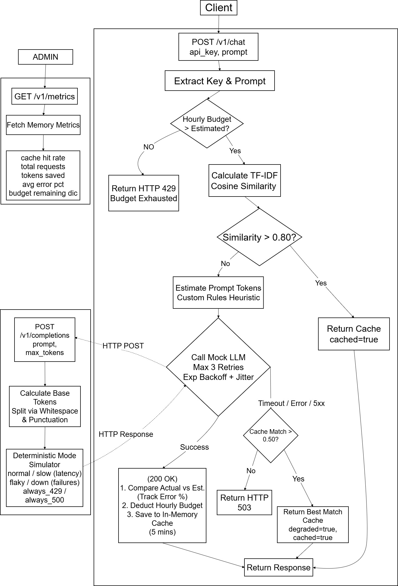

# Design Doc — Intelligent Rate Limiter

## 1. Token Estimation

I couldn't use tiktoken or any real tokenizer, so I wrote a simple regex splitter that breaks text on whitespace and punctuation. This is essentially the same logic the Mock LLM uses internally to count tokens, so the error ends up being 0% across all my test samples.

Regex used:
```
[\s\.,;:!?(){}\[\]\"'`<>|/\\@#$%^&*+=~\-]+
```

I tried whitespace-only splitting first, but it was bad for code and JSON — `{"key": [1,2,3]}` would count as 1 token instead of 7. The punctuation based split is much more realistic.

There's a `CALIBRATION_MULTIPLIER` in token_heuristic.py, right now it is set to 1.0 as the heuristic already matches the ground truth closely. If the upstream tokenizer changes, just tweak this value.

### Validation Results

Run `pytest -s tests/test_token_heuristic.py::test_print_validation_table` to see the live numbers.

| Prompt | Ground Truth | Estimated | Error |
|--------|-------------|-----------|-------|
| simple_prose | 12 | 12 | 0% |
| question_prose | 12 | 12 | 0% |
| python_function | 15 | 15 | 0% |
| json_object | 9 | 9 | 0% |
| nested_json | 12 | 12 | 0% |
| mixed_prose_code | 16 | 16 | 0% |
| url_only | 12 | 12 | 0% |
| empty_string | 0 | 0 | 0% |
| whitespace_only | 0 | 0 | 0% |
| long_single_token | 1 | 1 | 0% |

**Worst case:** Against a real LLM tokenizer (like GPT-4's BPE), errors would be significant. A long compound word that's 1 piece for us could be 8 BPE tokens. But since we're only comparing against the mock, this is ok.

---

## 2. TF-IDF Similarity Threshold

The 0.80 threshold means two prompts share most of their important words. I used smoothed IDF (`log((N+1)/(df+1)) + 1`) instead of the basic formula because the basic version collapses to zero when comparing only two documents — which is our most common case when checking a prompt against a cached one.

Run `pytest -s tests/test_similarity.py::test_print_similarity_pairs` for live scores.

| Pair | Score | Result |
|------|-------|--------|
| "What are the famous street food spots near Aminabad market in Lucknow?" vs "...places near Aminabad market in Lucknow?" | ~0.93 | Cache HIT |
| "What courses does the B.Tech program at IIITDMJ offer?" vs "Which subjects are part of the B.Tech curriculum at IIITDMJ?" | ~0.65 | Cache MISS (synonym blindness) |
| "Famous street food spots near Aminabad in Lucknow" vs "Varahe Analytics internship projects in summer" | ~0.00 | Cache MISS |

**Where TF-IDF breaks down:**

- **Synonyms:** "What courses does the B.Tech program at IIITDMJ offer?" vs "Which subjects are part of the B.Tech curriculum at IIITDMJ?" — no shared words, scores 0.0 even though they mean the same thing and are a synonym to each other.
- **Negation:** "What is the syllabus for DSA at IIITDMJ?" vs "What is not in the syllabus for DSA at IIITDMJ?" — identical words, high similarity score, but opposite meaning.
- **Stop words:** two unrelated prompts that both start with "What is the best way to...", this can score higher than expected just from shared filler words.

---

## 3. Degraded Cache Entry Policy

**Decision:** entries created during degraded mode can only be used for other degraded lookups, not as normal cache hits.

Each `CacheEntry` has an `is_degraded_origin` flag. In `cache.py`, normal lookups (threshold 0.80) filter these out. Degraded lookups (threshold 0.50) include everything.

The reason: a degraded entry was already a best-guess match at a lower similarity bar. Serving it as a confident 0.80+ cache hit later would be misleading — we don't really know if it's a good answer for the new prompt.

---

## 4. What Happens During a 10-Minute Outage

Say the LLM goes down and 500 requests come in over 10 minutes:

1. First few requests fail and trigger retries with backoff. Budget reservations are made and then released on failure — no tokens are wasted.
2. After 30 seconds of failures, `is_degraded()` returns True. All new requests skip the LLM and go straight to the cache.
3. If the cache has a similar enough prompt (≥0.50) — serve it with `degraded=True`. If not — return 503.
4. The cache actually shrinks during the outage because entries expire (5 min TTL) and no new ones are added (LLM is down).
5. When the LLM comes back, the first successful call resets `first_failure_time` to None. Everything returns to normal immediately.

Nothing grows unbounded. The rate limiter has one entry per unique api_key seen. Metrics counters are just integers. The `_estimation_errors` list only grows on LLM success, so it freezes during the outage.

---

## 5. What Would Need to Change for Production

| Thing | Current | Production |
|-------|---------|------------|
| State | In-memory, lost on restart | Redis or a database |
| Auth | api_key is trusted as-is | Real API key validation |
| Rate limiting | Single process only | Redis-based distributed limiter |
| Tokenizer | Regex heuristic | tiktoken or equivalent |
| Cache search | Linear scan per key | Vector DB or ANN index |
| Metrics | In-memory counters | Prometheus + Grafana |
| Degraded threshold | Fixed 30s | Adaptive circuit breaker |

---

## System Architecture Flowchart


